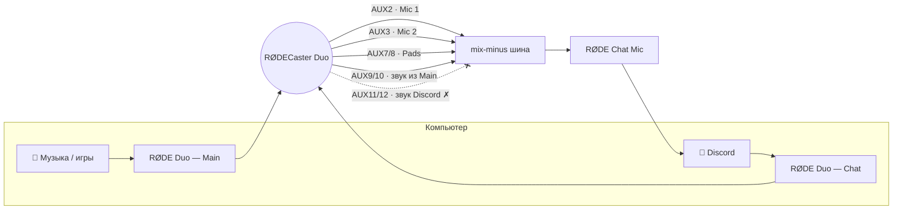

<div align="center">

# 🎙️ rodecaster-duo-channels

**RØDECaster Duo на Linux: отдельный канал под каждый источник и программный mix-minus для Discord**

[](https://github.com/MixaDoDs/rodecaster-duo-channels/actions/workflows/shellcheck.yml)


</div>

Из коробки Linux видит RØDECaster Duo как одно 15-канальное устройство `AUX0…AUX14`.
Discord и браузер такое не выберут, а в режиме Chat пульт отдаёт собеседникам **их же голоса**.
Этот скрипт одной командой:

- 🎚️ **режет Multitrack** на понятные микрофоны: `Main Mix`, `Mic 1`, `Mic 2`, `SMART Pads`;
- 🔇 **собирает честный mix-minus** — `RØDE Chat Mic`: твой голос, пэды и музыка, но **без звука из Discord**;
- 🏷️ **переименовывает** выходы в `Main` и `Chat` и сам разводит Discord/Zoom по ним;
- 📌 **закрепляет профиль Pro Audio**, чтобы после перезагрузки ничего не пропало;
- 🧪 **проверяет себя** тестовым тоном и показывает изоляцию в децибелах.

## Быстрый старт

```bash
git clone https://github.com/MixaDoDs/rodecaster-duo-channels.git
cd rodecaster-duo-channels
./rodecaster-duo.sh install
```

Затем в **Discord → Настройки → Голос и видео**:

| | Выбрать |
|---|---|
| Устройство ввода  | **RØDE Chat Mic (mix-minus, без эха ДС)** |
| Устройство вывода | **RØDE Duo — Chat (Discord, Zoom)** |

Проверить, что собеседники себя больше не слышат:

```bash
./rodecaster-duo.sh test
```
```
  музыка  → Chat Mic:  -24 дБ  (нужно выше −50)
  Discord → Chat Mic:  -92 дБ  (нужно ниже −70)

 ✓ mix-minus работает: изоляция 68 дБ
```

## Что появится в системе

**Входы**

| Устройство | Откуда | Для чего |
|---|---|---|
| **RØDE Chat Mic** | Mic 1 + Mic 2 + пэды + звук ПК из Main | Discord, Zoom, любые созвоны |
| RØDE Main Mix | общий микс пульта | запись/стрим «как слышно в наушниках» |
| RØDE Mic 1 | только первый микрофон, моно | чистый голос |
| RØDE Mic 2 | только второй микрофон, моно | гость |
| RØDE SMART Pads | только пэды, стерео | отдельная дорожка эффектов |
| RØDE Duo — Multitrack | все 15 каналов | OBS и DAW |
| RØDE Duo — Chat-In | аппаратный возврат Chat | ⚠️ содержит звук Discord — для созвонов не брать |

**Выходы**

| Устройство | Для чего |
|---|---|
| **RØDE Duo — Main** | музыка, игры, браузер — выход по умолчанию |
| **RØDE Duo — Chat** | Discord, Zoom — приложения попадают сюда автоматически |
| RØDE mix-minus (служебная шина) | внутренняя шина скрипта, ничего туда не выводи |

## Как это работает



Пульт подмешивает канал Chat в свой аппаратный возврат `pro-input-0`, поэтому собеседники
слышат сами себя. Замер тоном 7351 Гц показал одинаковый уровень в общем миксе и в этом
возврате: вычитания там нет. Скрипт собирает микс сам из отдельных дорожек Multitrack
и просто не берёт `AUX11/12`.

### Раскладка Multitrack

Снята замером на пульте с USB ID `19f7:004f` (15 каналов). У пульта нет имён каналов
ни в USB-дескрипторах, ни в ALSA-микшере, поэтому каналы определялись тестовыми тонами
и сигналами с пэдов и микрофона.

| Канал | Источник |
|---|---|
| `AUX0` `AUX1` | Main Mix |
| `AUX2` | Mic 1 |
| `AUX3` | Mic 2 |
| `AUX4` – `AUX6` | не задействованы (вероятно Bluetooth / USB 2) |
| `AUX7` `AUX8` | SMART Pads |
| `AUX9` `AUX10` | USB 1 Main — возврат звука с ПК |
| `AUX11` `AUX12` | USB 1 Chat — возврат звука с ПК |
| `AUX13` `AUX14` | не задействованы |

## Команды

```
./rodecaster-duo.sh install [опции]   поставить конфиги и перезапустить звук
./rodecaster-duo.sh status            показать устройства и куда идёт Discord
./rodecaster-duo.sh music [громкость] громкость музыки для собеседников: 40%, +5%, -3dB
./rodecaster-duo.sh test              проверить изоляцию mix-minus тоном
./rodecaster-duo.sh uninstall         удалить всё, что поставил скрипт
```

| Опция `install` | По умолчанию | Описание |
|---|---|---|
| `--default-mic chatmic\|mainmix\|keep` | `chatmic` | микрофон по умолчанию для всей системы |
| `--music-level V` | `50%` | громкость музыки для собеседников; уже подобранную не сбрасывает |
| `--latency N` | не задаётся | `node.latency = N/48000` для всех петель (например `112` для мониторинга голоса) |
| `--no-restart` | — | только записать файлы |
| `--dry-run` | — | показать сгенерированные конфиги и ничего не менять |

Скрипт пишет только в свои три файла:

```
~/.config/pipewire/pipewire.conf.d/90-rodecaster-duo-split.conf
~/.config/pipewire/pipewire.conf.d/91-rodecaster-duo-mixminus.conf
~/.config/wireplumber/wireplumber.conf.d/99-rodecaster-duo.conf
```

Чужой файл с тем же именем сохраняется в `*.bak-<дата>`, `uninstall` удаляет только файлы
с меткой `managed-by: rodecaster-duo-channels`. Серийный номер пульта определяется
автоматически, `sudo` не нужен.

## Нюансы

- **Прошивка.** Раскладка верна для 15-канального Multitrack. Если пульт отдаёт другое число
  каналов (прошивка 1.7.3, USB ID `19f7:0095`), скрипт откажется ставиться — для неё есть
  [parzival-space/rodecaster-pro-2-virtual-devices-pipewire](https://github.com/parzival-space/rodecaster-pro-2-virtual-devices-pipewire).
- **Фейдер пульта не влияет на музыку в Discord.** Дорожка музыки в Multitrack снимается
  до фейдера, а привязать громкость к фейдеру не выходит: общий микс пульта не раскладывается
  на дорожки линейно (пульт обрабатывает звук), а по MIDI положение фейдера не приходит.
  Поэтому громкость музыки для собеседников задаётся отдельно:
  ```bash
  ./rodecaster-duo.sh music        # показать: 50% (-18,06 дБ)
  ./rodecaster-duo.sh music 35%    # тише
  ./rodecaster-duo.sh music +5%    # чуть громче
  ```
  При установке она ставится на 50%, а не на 100%, как было раньше: на 100% друзья слышали
  музыку громче, чем ты в наушниках.
- **Discord помнит устройство сам.** Правило WirePlumber переключит его при первом подключении,
  но выбор в настройках Discord надёжнее.
- **`WEBRTC VoiceEngine`** — так называются и Discord, и звонки из Chromium-браузеров.
  Созвоны в браузере тоже уйдут в Chat, обычно это и нужно.
- **Пакет `rodecaster-duo-pipewire`** (PKGBUILD от ernestoacostame) совместим: файл скрипта грузится позже и перекрывает
  его названия.
- **Профили других карт.** После рестарта PipeWire профили соседних звуковых карт иногда
  сбрасываются в `off`; скрипт запоминает их до рестарта и возвращает.

## Требования

- PipeWire 1.x с `pipewire-pulse` и WirePlumber 0.5+
- `pactl`, `systemctl --user`
- для `test`: `python3`, `pw-play`, `pw-record`

Проверено: CachyOS, PipeWire 1.6.8, WirePlumber 0.5.17.

## Благодарности

- [ernestoacostame/rodecaster-duo-pipewire](https://github.com/ernestoacostame/rodecaster-duo-pipewire) — имена устройств Duo
- [parzival-space/rodecaster-pro-2-virtual-devices-pipewire](https://github.com/parzival-space/rodecaster-pro-2-virtual-devices-pipewire) — виртуальные устройства для прошивки 1.7.3

## Лицензия

[MIT](LICENSE)
